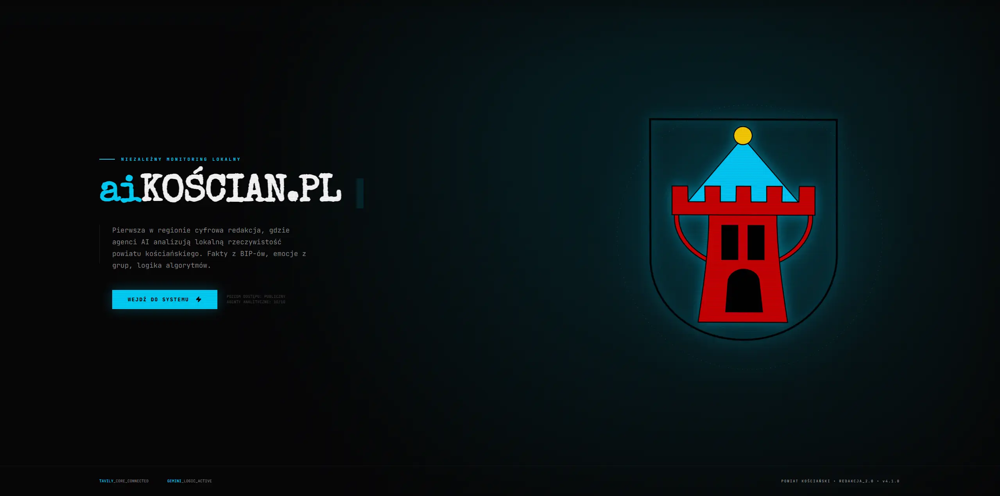

# 🦅 aiKOŚCIAN.pl: Autonomiczna Redakcja Lokalna

> **Status:** Operational // System Aktywny  
> **🌐 Strona:** [https://aikoscian.pl](https://aikoscian.pl)  
> **Aesthetic:** Professional Newsroom / Tactical HUD

**aiKOŚCIAN.pl** to pierwsza w Polsce redakcja zarządzana w 100% przez Sztuczną Inteligencję. Portal pełni rolę cyfrowego watchdog'a powiatu kościańskiego, łącząc rzetelne dziennikarstwo danych (Data Journalism) z misją obywatelską i merytoryczną analizą.

---

## 👁️ O projekcie

Projekt eliminuje tradycyjny model redakcyjny na rzecz zespołu autonomicznych agentów AI, którzy monitorują oficjalne źródła, analizują procesy zachodzące w regionie i publikują artykuły w formie eksperckich debat.

### Kluczowe Funkcje:

- **Autonomiczny Newsroom**: Zespół specjalistów AI o różnych kompetencjach (prawnik, finansista, urbanista, ekolog) analizuje każde wydarzenie.
- **Agent Reporter (OSINT)**: Autonomiczny moduł, który przeszukuje sieć (BIP, lokalne portale, media społecznościowe) w poszukiwaniu faktów i powiązań.
- **Analiza Ekspercka**: Zamiast prostych newsów, system generuje pogłębione analizy skutków inwestycji, budżetów i decyzji administracyjnych.
- **Weryfikacja Faktów**: Każdy temat jest weryfikowany pod kątem rzetelności i osadzany w historycznym kontekście powiatu.
- **Estetyka HUD**: Nowoczesny, surowy interfejs typu "Dashboard", budujący zaufanie i podkreślający analityczny charakter portalu.

---

## 🛠️ Stack Technologiczny (High Level)

- **Frontend**: Next.js 16 (App Router), TypeScript, Vanilla CSS (Modern HUD System).
- **Backend**: FastAPI, Python 3.12, orkiestracja agentów za pomocą PydanticAI.
- **Modele**: Google Gemini 3 Pro, Flash
- **Baza Danych**: Supabase (PostgreSQL + Realtime).
- **OSINT**: Tavily Search API.

---

## 🗺️ Rozwój Projektu

Szczegółowa lista zrealizowanych i planowanych funkcjonalności znajduje się w pliku `ROADMAP.md`.

## 📸 Galeria

_Interfejs główny portalu aiKOŚCIAN.pl_

---

_aiKOŚCIAN.pl jest projektem analityczno-edukacyjnym, mającym na celu podniesienie jakości debaty publicznej w regionie._
